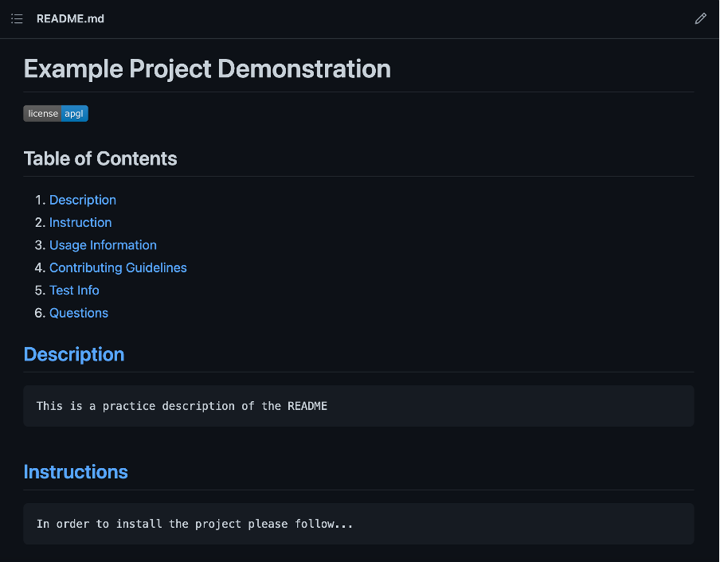

# README-Generator

## Table of Contents
1. [Description](#description)
2. [Instruction](#Instructions)
3. [Questions](#questions)

## [Description](#table-of-contents)

    This weeks project was to create a README generator to allow users to rapidly and easily create README files.

## [Instructions](#table-of-contents)

    In order to use this file

    1. Ensure Node is installed
    2. Run "npm i"
    3. Run program by running node "index.js"

## [Questions](#table-of-contents)

If you have any questions please don't hestitate to email me at [ogray54@gmail.com](#ogray54@gmail.com).

If you would like to see more of my work please find me at [GitHub](#www.github.com/OGray96)

